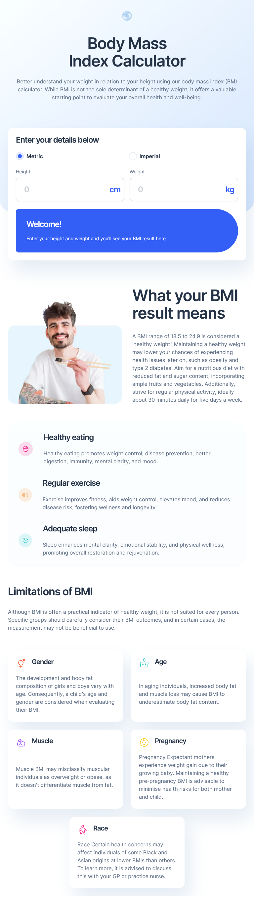
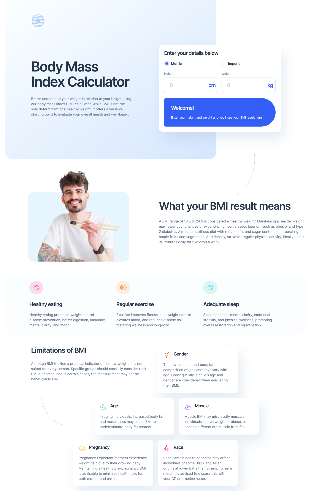

# Frontend Mentor - Body Mass Index Calculator solution

This is a solution to the [Body Mass Index Calculator challenge on Frontend Mentor](https://www.frontendmentor.io/challenges/body-mass-index-calculator-brrBkfSz1T). Frontend Mentor challenges help you improve your coding skills by building realistic projects.

## Table of contents

- [Overview](#overview)
  - [The challenge](#the-challenge)
  - [Screenshot](#screenshot)
  - [Links](#links)
- [Built with](#built-with)
- [Author](#author)

## Overview

### The challenge

Users should be able to:

- Select whether they want to use metric or imperial units
- Enter their height and weight
- See their BMI result, with their weight classification and healthy weight range
- View the optimal layout for the interface depending on their device's screen size
- See hover and focus states for all interactive elements on the page

### Screenshot

### Links

- [Solution Repo](https://github.com/samilaug/bmi-calculator-challenge)
- [Live Site](https://bmi-calculator-challenge.vercel.app/)

## My process

### Built with

- Semantic HTML5 markup
- Flexbox
- CSS Grid
- Mobile-first workflow
- [Astro](https://astro.build/) - Framework
- [React](https://react.dev/) - React
- [Tailwind CSS](https://tailwindcss.com/) - Styles

## Author

- Frontend Mentor - [@samilaug](https://www.frontendmentor.io/profile/samilaug)
- Linkedin - [samila-gunarathna](https://www.linkedin.com/in/samila-gunarathna/)
